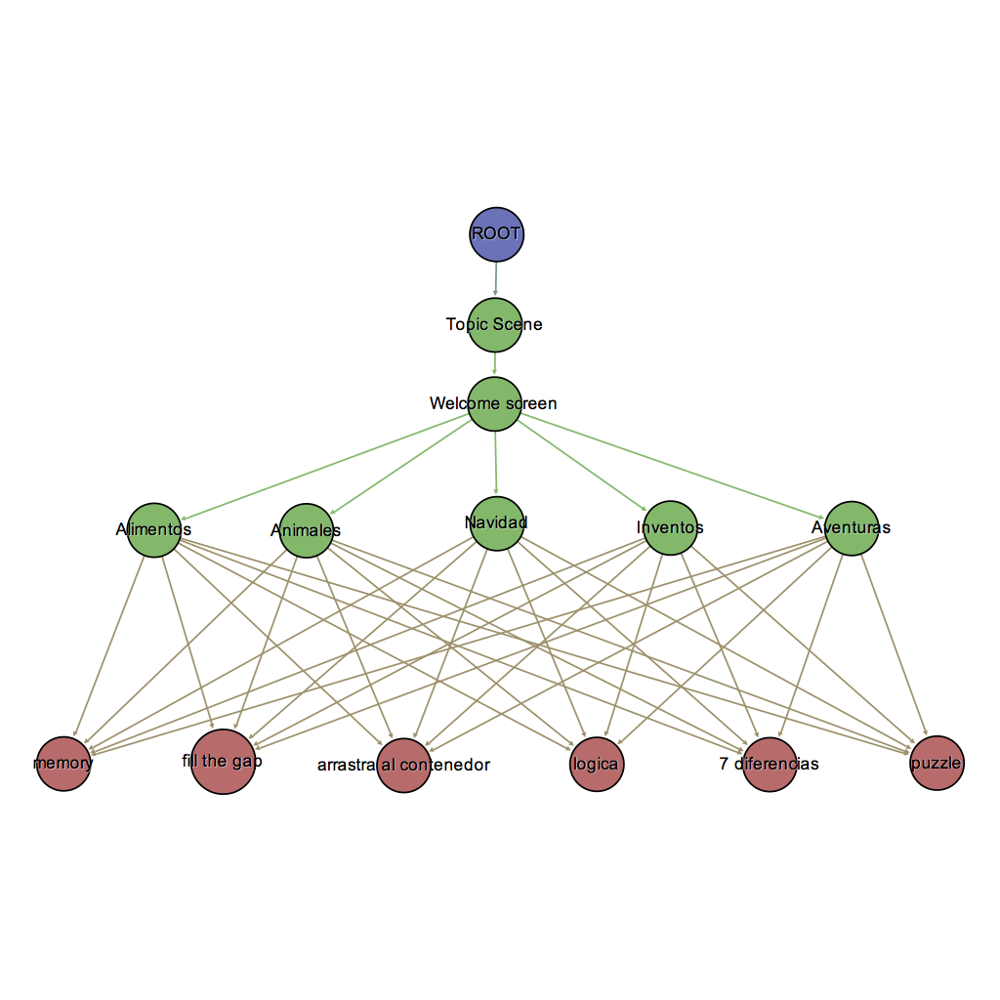

.. _content-graph:

=============
Content Graph
=============

The content graph is a definition of how game scenes are arranged. Also establishes a
relation with cognitive concepts developed during the session of a player. This graph is
non-mutable as per content version, meaning that is a contract between the content
developer and Infantium. This graph can extended or altered with new content update
releases but doing a content graph update requires submitting content for approval
to Infantium.

The game graph is internally defined at Infantium in a per content manner. The developer
will be informed in which cognitive game scenes his content will be arranged in order to
make content cognitive data from player to flow to Infantium servers.

Content graph example where each content node has an unique identifier label.

Graph Walker
''''''''''''

A walker represents the flow for an Infantium player through the passing of a content
session in which cognitive improvement tasks will be performed. It is in charge of
traversing the content graph, collecting cognitive data and data analytics.

It's usage is simple, starting a game session creates a clean graph walker for an specified
content, then the developer only needs to add code lines when a game scene transition occurs.
Then the analytics and networking part are done magically in a separate background thread.

Player
''''''

An Infantium Player refers to a unique identity of a user executing an Infantium Session.
As defined by means of collecting user data, each session must be identified with a player
to know from who the data we collect is talking about. This process is done automatically
if the Infantium App is installed on the same device of the hosted content (now only Android
is supported in this task), but there are some cases in which player is requested to be
identified before content consumption even though is is not the normal case.

Infantium menu
''''''''''''''

When playing a content that has Infantium integrated into it shake the device to let Infantium
menu appear on screen. The menu allows kids to return to Infantium App easily, also shows the
current logged in user for that game and presents some useful data.