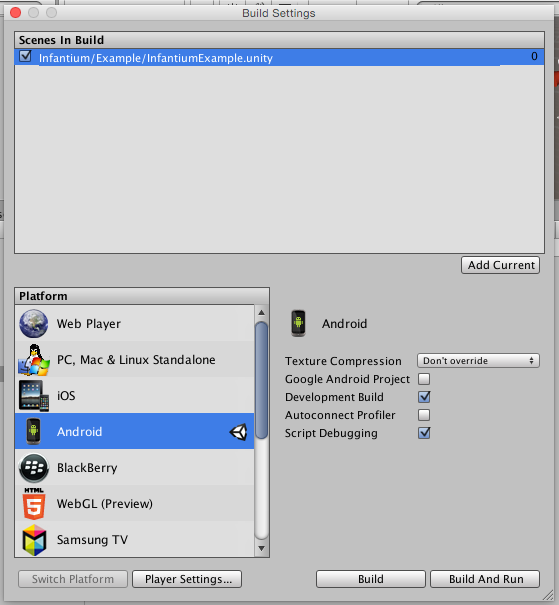
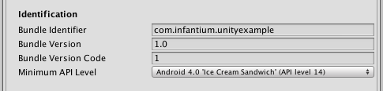

===========
Unity Guide
===========

Unity Example
'''''''''''''

Inside .unitypackage there is a simple project example that contains all avaliable SDK2 function calls. Please refer to it for C# syntax.

Traverse the graph
''''''''''''''''''

As in native Android development, to transverse the graph simply call to `moveNext(<node_id>)` with the specified node identification to move into.

.. code-block:: c#

	// Get infantium SDK singleton
	infantium = InfantiumUnityAndroid.getInstance();

	// Walk up to a terminal node
	infantium.moveNext("Topic Scene");
	infantium.moveNext("Welcome screen");
	infantium.moveNext("Alimentos");
	infantium.moveNext("memory");
		

Scoring a Terminal Node
'''''''''''''''''''''''

Score a terminal node is as easy as calling the fucntions from an instantiated score of a terminal node.

.. code-block:: c#

    // Set score of player
	BasicScoring s = infantium.getScorer<BasicScoring> ();
	s.success ();
	s.fail ();
	s.neutral ();
	
	// Evaluate the terminal node
	infantium.evaluate ();

Enable debugging on build
'''''''''''''''''''''''''

To make the integration process we encourage developers to enable Development build when targeting the app for Android devices. This extends the android logcat with
helpful info with trace for errors on SDK2 Android bridge.

To compile the app without errors while using the Unity Android plugin, required minimum api level is 14. To modify it click on "Player Settings..." button and modify it.

Activate Infantium Shaker
'''''''''''''''''''''''''

In Unity, you can activate Infantium Shaker that allows users to cleanly go back to Infantium by shaking the device with the following API call:

.. code-block:: c#

	// Start infantium shaker :)
	infantium.startShaker ();

